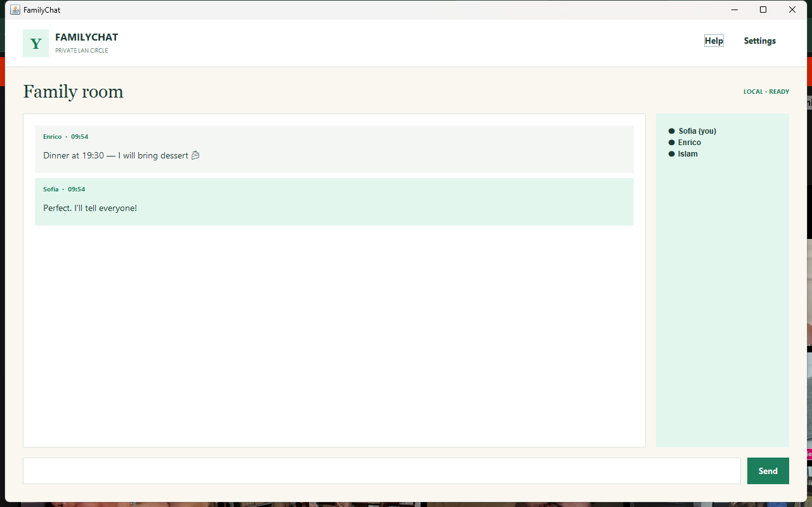

<div align="center">
  
  <h1>FamilyChat 2</h1>
  <p><strong>Your people · Your network · Your conversation</strong></p>
  <p>A calm Java desktop chat that stays inside the trusted home LAN.</p>
  <p><a href="https://github.com/sofoste93/FamilyChat/releases/latest">Download</a> · <a href="#how-to-use">How to use</a> · <a href="#learning-tour">Learning tour</a></p>
</div>



## What version 2 brings

- One friendly desktop app can start a room or join one.
- No account, cloud, database, history, analytics or telemetry.
- Live family roster, join/leave notices and UTF-8 messages.
- Help and settings are included in the interface.
- Console commands remain available for learners and headless hosts.
- Native packages contain Java for Windows, Linux and both Mac architectures.

## Download

Choose the archive from the [latest release](https://github.com/sofoste93/FamilyChat/releases/latest):

| System | Archive |
| --- | --- |
| Windows x64 | `FamilyChat-Windows-x64.zip` |
| Linux x64 | `FamilyChat-Linux-x64.tar.gz` |
| macOS Intel | `FamilyChat-macOS-x64.tar.gz` |
| macOS Apple Silicon | `FamilyChat-macOS-arm64.tar.gz` |

Extract the archive and launch `FamilyChat`. Java is already included.

## How to use

1. On one computer, enter a name and port, then select **Start a room on this PC**.
2. Find that computer's private IPv4 address (`ipconfig` on Windows, `ip addr` on Linux, Network Settings on macOS).
3. On the other computers, enter the host address, same port and a unique name, then select **Join room**.
4. If the firewall asks, allow FamilyChat only on private networks.

The default port is `6868`. Everyone must be on the same trusted LAN or Wi-Fi.

## Learning tour

- `Main.java` selects desktop, version, screenshot or preserved console commands.
- `FamilyChatApp.java` demonstrates Swing cards, background networking and callbacks to the Event Dispatch Thread.
- `ChatServer.java` owns the TCP listener and concurrent user registry.
- `UserThread.java` contains the small line protocol and deterministic socket cleanup.
- `ChatServerIntegrationTest.java` connects two real clients and verifies an UTF-8 message end to end.

Build from source with JDK 17+ and Maven:

```bash
mvn clean verify
java -jar target/family-chat-2.0.0.jar
```

The restored console release remains available as [v1.1.0](https://github.com/sofoste93/FamilyChat/releases/tag/v1.1.0).

## Security scope

FamilyChat uses unencrypted TCP and intentionally has no internet service. Other users on an untrusted network may observe or alter traffic. Never forward its port on a router and do not use it for sensitive information. A future version can add authenticated end-to-end encryption without changing the local-first model.

## License

[MIT](LICENSE) © Sofoste contributors.
