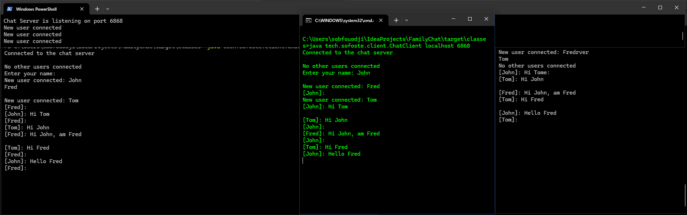

# FamilyChat Console 1.1

FamilyChat is a small Java console chat for people connected to the same local network. This release restores the original 1.0 university experiment before the desktop version 2.



## Download

Download `family-chat-console-1.1.0.jar` from the [v1.1.0 release](https://github.com/sofoste93/FamilyChat/releases/tag/v1.1.0). Java 8 or newer is required.

Start the host computer:

```bash
java -jar family-chat-console-1.1.0.jar server 6868
```

On each family computer, connect with the host's local IP address:

```bash
java -jar family-chat-console-1.1.0.jar client 192.168.1.20 6868
```

Type `/quit` or `bye` to leave. Allow TCP port `6868` through the host firewall for private networks if prompted.

## Learning tour

- `Main.java` parses the two launcher commands.
- `ChatServer.java` owns the listener and the thread-safe user registry.
- `UserThread.java` owns exactly one socket and cleans it in `finally`.
- `ChatClient.java`, `ReadThread.java` and `WriteThread.java` split console input and network input so neither blocks the other.
- The integration test opens two real loopback sockets and verifies an UTF-8 message.

Build and test with:

```bash
mvn clean verify
java -jar target/family-chat-console-1.1.0.jar --help
```

## Network and privacy

Version 1 uses unencrypted TCP inside the LAN. Anyone able to observe the network traffic may read messages. Use it only on a trusted private network and never expose the port to the internet. Version 2 improves the user experience and packaging while keeping the same local-network scope.

## License

[MIT](LICENSE) © Sofoste contributors.

